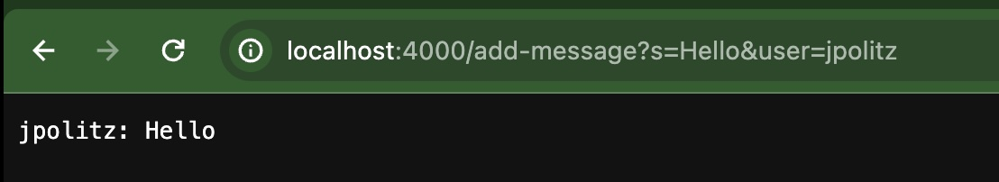

# Lab Report 2 - Servers and SSH Kets (Week 3)

# Part 1 #
## Code for `ChatServer`

## Terminal for `ChatServer`

## Screenshot 1 for `/add-message`
### (Descriptions under screenshot image)

***Which methods in your code are called?***\
The methods that are called in my code are the `start()` method in the `Server.java` file and the `handleRequest()` and `main()` methods in the `ChatServer.java` file.

***What are the relevant arguments to those methods, and the values of any relevant fields of the class?***\
`start()`: the relevant arguments to this method are `port`, which contains the port number of the server (4000 in my example), and `handler`, which is an Object of the `Handler` class which contains the `handleRequest()` method.\
`handleRequest()`: the relevant arguments to this method are `url` which is the url of the web server that is created to execute this program. In this example, the `url` is set to the value of `new URI(http://localhost:4000/add-message?s=Hello&user=jpolitz)`\
`main()`: the relevant arguments to this method are `args` which is the array of arguments that is provided by the user. In this example, the `args` array only contains one value, which is `4000`, to represent the port number for the `start()` method.\
Additionally, a relevant field of the `Handler` class is the `messages`, `user`, and `message` fields. The `messages` field is an ArrayList of Strings that stores the `user` and `message` fields to display. In this example, the `messages` ArrayList contains one value of `jpolitz: Hello` because the `user` field is set to `jpolitz` and the `message` field is set to `Hello`.

***How do the values of any relevant fields of the class change from this specific request? If no values got changed, explain why.***\
In this specific request, the value of `port` is set to `4000` because I provide the port address of `4000` in the command-line argument when I call the command `java ChatServer 4000`. The `user` field is set to `jpolitz`, and the `message` field is set to `Hello`. Additionally, the `messages` ArrayList changes to contain a value of `jpolitz: Hello`.

## Screenshot 2 for `/add-message`
### (Descriptions under screenshot image)

***Which methods in your code are called?***\
The methods that are called in my code are the `start()` and `handle()` methods in the `Server.java` file and the `handleRequest()` and `main()` methods in the `ChatServer.java` file.

***What are the relevant arguments to those methods, and the values of any relevant fields of the class?***\
`start()`: the relevant arguments to this method are `port`, which contains the port number of the server (4000 in my example), and `handler`, which is an Object of the `Handler` class which contains the `handleRequest()` method.\
`handleRequest()`: the relevant arguments to this method are `url` which is the url of the web server that is created to execute this program. In this example, the `url` is set to the value of `new URI(http://localhost:4000/add-message?s=How%20are%20you&user=yash)`\
`main()`: the relevant arguments to this method are `args` which is the array of arguments that is provided by the user. In this example, the `args` array only contains one value, which is `4000`, to represent the port number for the `start()` method.\
Additionally, a relevant field of the `Handler` class is the `messages`, `user`, and `message` fields. The `messages` field is an ArrayList of Strings that stores the `user` and `message` fields to display. In this example, the `messages` ArrayList contains two values of `jpolitz: Hello` and `yash: How are you` because the `user` field is set to `yash` and the `message` field is set to `How are you`.

***How do the values of any relevant fields of the class change from this specific request? If no values got changed, explain why.***\
In this specific request, the `user` field changes to `yash`, and the `message` field changes to `How are you`. Additionally, the `messages` ArrayList changes to contain values of `jpolitz: Hello` and `yash: How are you`.

# Part 2 #
***absolute path to private key***

***absolute path to public key***

***log into ieng6 account w/o password***

# Part 3 #
In week 2 and 3, I learned about how to connect to a remote computer and run a server on that computer, which I had no idea how to do before. Learning about how to write the code to create the server using the `URLHandler` interface was very fascinating to me. Additionally I learned about how *localhost* and *ports* work. Before I learned about how they work in week 2 and 3, I previously heard these terms, but was unsure about what they meant. Finally, learning about the `curl` command was something new I learned how to use that I didn't know about before.
