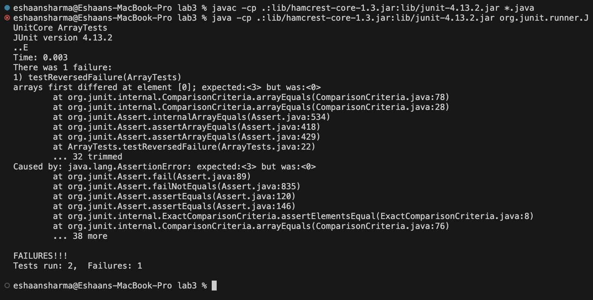

# Lab Report 3 - Symptoms and Failure-Inducing Inputs

# Part 1 - Bugs #

The bug I chose is the `reversed()` method in the `ArrayExamples.java` file\
**Original Method Code:**
```
// Returns a *new* array with all the elements of the input array in reversed order
  static int[] reversed(int[] arr) {
    int[] newArray = new int[arr.length];
    for(int i = 0; i < arr.length; i += 1) {
      arr[i] = newArray[arr.length - i - 1];
    }
    return arr;
  }
```
<br />

**A failure-inducing input for the buggy program:**
```
@Test
  public void testReversedFailure() {
    int[] input3 = {1, 2, 3};
    assertArrayEquals(new int[]{3,2,1}, ArrayExamples.reversed(input3));
  }
```

**An input that doesn't induce a failure:**
```
@Test
  public void testReversedSuccess() {
    int[] input4 = {0,0,0,0};
    assertArrayEquals(new int[]{0,0,0,0}, ArrayExamples.reversed(input4));
  }
```

**The symptom:**


**The bug:**
<br />
*Before:*
```
// Returns a *new* array with all the elements of the input array in reversed order
  static int[] reversed(int[] arr) {
    int[] newArray = new int[arr.length];
    for(int i = 0; i < arr.length; i += 1) {
      arr[i] = newArray[arr.length - i - 1];
    }
    return arr;
  }
```
*After:*
```
// Returns a *new* array with all the elements of the input array in reversed order
  static int[] reversed(int[] arr) {
    int[] newArray = new int[arr.length];
    for (int i = 0; i < arr.length; i+=1) {
      newArray[i] = arr[i];
    }

    for(int i = 0; i < arr.length; i += 1) {
      arr[i] = newArray[arr.length - i - 1];
    }
    return arr;
  }
```

This fix addresses the issue because in the original code, `newArray` is an empty integer array that has equal length to `arr`, but all the values are set to 0 by default. In the original code `newArray` does not copy the values from `arr`, so in the for-loop the values of 0 are set to each of the values at every index in the `arr`, and an `arr` of 0s with the same length as the inputted `arr` is returned by the original code for the `reversed()` method. In my updated code, `arr` is traversed and each value is copied into `newArray`. As a result, the for-loop runs properly as the values starting from the end of `newArray` are assigned to the indexes starting for the start of `arr`. The fixed `reversed()` method returns `arr` with it's initial values in reverse order.

# Part 2 - Researching Commands #

The command I chose is `grep`
*(Source cited at the bottom)*

1: `grep -n "pattern" filename.txt`

```
grep -n "terrorist" technical/911report/chapter-1.txt

62:    They were planning to hijack these planes and turn them into large guided missiles, loaded with up to 11,400 gallons of jet fuel. By 8:00 A.M. on the morning of Tuesday, September 11,2001, they had defeated all the security layers that America's civil aviation security system then had in place to prevent a hijacking. The Hijacking of American 11 American Airlines Flight 11 provided nonstop service from Boston to Los Angeles. On September 11, Captain John Ogonowski and First Officer Thomas McGuinness piloted the Boeing 767. It carried its full capacity of nine flight attendants. Eighty-one passengers boarded the flight with them (including the five terrorists).22 The plane took off at 7:59. Just before 8:14, it had climbed to 26,000 feet, not quite its initial assigned cruising altitude of 29,000 feet. All communications and flight profile data were normal. About this time the "Fasten Seatbelt" sign would usually have been turned off and the flight attendants would have begun preparing for cabin service.
68:    We do not know exactly how the hijackers gained access to the cockpit; FAA rules required that the doors remain closed and locked during flight. Ong speculated that they had "jammed their way" in. Perhaps the terrorists stabbed the flight attendants to get a cockpit key, to force one of them to open the cockpit door, or to lure the captain or first officer out of the cockpit. Or the flight attendants may just have been in their way.
70:    At the same time or shortly thereafter, Atta-the only terrorist on board trained to fly a jet-would have moved to the cockpit from his business-class seat, possibly accompanied by Omari. As this was happening, passenger Daniel Lewin, who was seated in the row just behind Atta and Omari, was stabbed by one of the hijackers-probably Satam al Suqami, who was seated directly behind Lewin. Lewin had served four years as an officer in the Israeli military. He may have made an attempt to stop the hijackers in front of him, not realizing that another was sitting behind him.
172:    The terrorists who hijacked three other commercial flights on 9/11 operated in five-man teams. They initiated their cockpit takeover within 30 minutes of takeoff. On Flight 93, however, the takeover took place 46 minutes after takeoff and there were only four hijackers. The operative likely intended to round out the team for this flight, Mohamed al Kahtani, had been refused entry by a suspicious immigration inspector at Florida's Orlando International Airport in August.
196:    During at least five of the passengers' phone calls, information was shared about the attacks that had occurred earlier that morning at the World Trade Center. Five calls described the intent of passengers and surviving crew members to revolt against the hijackers. According to one call, they voted on whether to rush the terrorists in an attempt to retake the plane. They decided, and acted.
224:    On 9/11, the terrorists turned off the transponders on three of the four hijacked aircraft. With its transponder off, it is possible, though more difficult, to track an aircraft by its primary radar returns. But unlike transponder data, primary radar returns do not show the aircraft's identity and altitude. Controllers at centers rely so heavily on transponder signals that they usually do not display primary radar returns on their radar scopes. But they can change the configuration of their scopes so they can see primary radar returns. They did this on 9/11 when the transponder signals for three of the aircraft disappeared.
230:    The threat of Soviet bombers diminished significantly as the Cold War ended, and the number of NORAD alert sites was reduced from its Cold War high of 26. Some within the Pentagon argued in the 1990s that the alert sites should be eliminated entirely. In an effort to preserve their mission, members of the air defense community advocated the importance of air sovereignty against emerging "asymmetric threats" to the United States: drug smuggling, "non-state and state-sponsored terrorists," and the proliferation of weapons of mass destruction and ballistic missile technology.
232:    NORAD perceived the dominant threat to be from cruise missiles. Other threats were identified during the late 1990s, including terrorists' use of aircraft as weapons. Exercises were conducted to counter this threat, but they were not based on actual intelligence. In most instances, the main concern was the use of such aircraft to deliver weapons of mass destruction.
234:    Prior to 9/11, it was understood that an order to shoot down a commercial aircraft would have to be issued by the National Command Authority (a phrase used to describe the president and secretary of defense). Exercise planners also assumed that the aircraft would originate from outside the United States, allowing time to identify the target and scramble interceptors. The threat of terrorists hijacking commercial airliners within the United States-and using them as guided missiles-was not recognized by NORAD before 9/11. Notwithstanding the identification of these emerging threats, by 9/11 there were only seven alert sites left in the United States, each with two fighter aircraft on alert. This led some NORAD commanders to worry that NORAD was not postured adequately to protect the United States.
586:The Pentagon Teleconferences. Inside the National Military Command Center, the deputy director for operations immediately thought the second strike was a terrorist attack. The job of the NMCC in such an emergency is to gather the relevant parties and establish the chain of command between the National Command Authority-the president and the secretary of defense- and those who need to carry out their orders.
```

```
grep -n "Thy-1" technical/biomed/1471-213X-1-11.txt

125:          Fig. 1Cshows staining for Thy-1 glycoprotein, also
126:          called Thy-1 differentiation protein [ 22], of
129:          membrane. Detail of Thy-1 staining (Fig. 1D) shows that
137:          cells. Hence, targets for Thy-1 vesicles appear to be
141:          The intercellular Thy-1 vesicles have been shown by
142:          immunoelectron microscopy to exhibit Thy-1 surface
143:          expression and to contain a substance lacking Thy-1
148:          expressing receptor for Thy-1 ligand. However, the
149:          receptor for Thy-1 has not been yet identified.
151:          intercellular Thy-1 vesicles can be enabled by tissue
152:          specificity of Thy-1 glycoprotein carbohydrate moieties [
153:          24]. Thy-1 differentiation protein consists of a single
164:          function of Thy-1 and other Ig-related molecules is to
465:          Oncogene Science, Cambridge, MA. Thy-1 (F15-42-01)
```

**the command `grep -n "pattern" filename.txt` is going through the specified file (`technical/911report/chapter-1.txt` and `technical/biomed/1471-213X-1-11.txt` in the cases above) and searching for pattern (`terrorist` and `Thy-1` in the cases above) and their line numbers. This is useful for looking for a specific word or pattern of characters in a large file and identifying the line numbers that correspond to the matching cases. In the first case above, this command was helpful for finding the line numbers that contain the word "terrorist" in the file about 911 reports. In the second case above, this command was helpful for finding the line numbers that contain the character pattern "Thy-1" in the biomed report.**

<br />

2: `grep -H -c "pattern" /path/to/files/*.txt`

```
grep -H -c "199" technical/911report/chapter-13.3.txt

technical/911report/chapter-13.3.txt:454
```

```
grep -H -c "ED" technical/government/Alcohol_Problems/Session2-PDF.txt

technical/government/Alcohol_Problems/Session2-PDF.txt:50
```

**the command `grep -H -c "pattern" /path/to/files/*.txt` is going through the specified file (`technical/911report/chapter-13.3.txt` and `technical/government/Alcohol_Problems/Session2-PDF.txt` in the cases above) and searching for pattern (`199` and `ED` in the cases above) and the number of lines that match the pattern. This is useful for looking for the number of lines in a big file that contain the pattern you want if you do not care about the content of the lines and only just the number. In the first case above, this command was helpful for finding the number of lines that contained the number "199" in the file about 911 report. In the second case above, this command was helpful for finding the number of lines that contained "ED" in the file about alcohol problems.**

<br />

3: `grep -rnH "pattern" /path/to/search`

```
grep -rnH "brain damage" technical/plos

technical/plos/journal.pbio.0020046.txt:24:        age, without apparent brain damage or other known cause (“idiopathic”). It is important to
technical/plos/pmed.0020140.txt:60:          ischemic brain damage [3].
technical/plos/pmed.0010021.txt:32:        (visceral damage in Gaucher disease is reversible whereas the brain damage usually is not).
```

```
grep -rnH "carbon monoxide" technical/government/Env_Prot_Agen

technical/government/Env_Prot_Agen/section-by-section_summary.txt:788:matter and carbon monoxide emissions. Where there is a modification
technical/government/Env_Prot_Agen/final.txt:156:six pollutants: ozone, carbon monoxide (CO); particulate matter
technical/government/Env_Prot_Agen/bill.txt:357:material into a gas consistingprimarily of carbon monoxide and
```

**the command `grep -rnH "pattern" /path/to/search` is recursively searching a specified directory (`technical/plos` and `technical/government/Env_Prot_Agen` in the cases above) and searching for a pattern (`brain damage` and `carbon monoxide` in the cases above) and the lines and their lines numbers that match the patten. This is useful for when you are trying to find a specified pattern in a directory of many files as you are able to see what file the pattern is in and what line it is contained in. In the first case above, this command was helpful for finding the lines and their line numbers that contains "brain damage" in the `technical/plos` directory. In the second case above, this command was helpful for finding the the lines and their line numbers that conbtains "carbon monoxide" in the `technical/government/Env_Prot_Agen` directory.**

<br />

4: `grep -e "pattern1" -e "pattern2" filename.txt`

```
grep -e "1999" -e "2000" technical/government/Post_Rate_Comm/Cohenetal_comparison.txt

they become profitable (Cohen et al. 2000). A post could also
(739 pieces in 1999), while Italy has one of the lowest (115 pieces
in 1999).4
the USO. (Cohen 1999, 2000) However, this result may not apply to
to the Household Diary Study (United States Postal Service 2000),
in 1999, 56 percent of the pieces received by U.S. households were
capita of direct mail in 1999.
the structure of FY 1999 costs in the U.S. Postal Service.
dollar to convert the 1999 Italian statistics reported in Italian
liras required in 1999 to buy goods and services equivalent to what
can be purchased with one U.S. dollar. In 1999, the average market
1999a
1999 as provided in the most recent omnibus rate proceeding, Docket
No. R2000-1 to benchmark the model10 Table 2 shows the U.S.
1999)
Source: Postal Rate Commission Docket No. R2000-1
(1999 U.S. Dollars)
(Crew and Kleindorfer 2000) owing to the loss of volume because of
cost of the route (Cohen et al. 1999). Some mail handled by a
Data in this paper are from 1999. In that year, the U.S. Postal
routes by profit margin using FY 1999 data. Again, we have adjusted
distribution. (Berthelemy and Toledano 2000; Kolin and Smith 1999)
Cohen et al. (2000) found that less than 16 percent of total
1999).
Bradley and Colvin (2000) estimated the entry pricing cost of
of volume (Q), based on the USPS cost structure for FY 1999.
Fixed Cost for FY 1999 nd = Subscript that indicates non-delivery
1999 U.S. Population Q = Quantity (Volume) per capita Q0 = USPS
Volume per capita for FY 1999 TC = Total Cost V = USPS Variable
Cost for FY 1999
do not exist for Poste Italiane. The USPS variable costs in FY 1999
Berthélémy, Francoise L., and Joëlle Toledano. 2000. "In France,
Bradley, Michael D., and Jeff Colvin. 2000. "Measuring the Cost
Spyros S. Xenakis. 1999. "An Analysis of the Potential for Cream
Spyros S. Xenakis. 2000. "Universal Service without a Monopoly." In
Crew, Michael A., and Paul R. Kleindorfer. 2000. "Liberalization
Kolin, Marshall and Edward J. Smith. 1999. "Mail Goes Where the
Rodriguez, Frank, Stephen Smith and David Storer. 1999.
Scarfiglieri, Gennaro, and Vincenzo Visco Comandini. 2000.
United States Postal Service. 2000. "The Household Diary Study,
Fiscal Year 1999." Volume 1.
```

```
grep -e "dependence" -e "abuse" technical/government/Alcohol_Problems/Session2-PDF.txt      
(ICD-9, -10) have rigorously defined alcohol abuse and alcohol
dependence.3 These definitions largely agree for dependence, but
not for abuse. DSM includes social and legal consequences of abuse
cases of alcohol abuse meet the ICD-10 definition. In general, an
abuse and dependence. CAGE is a mnemonic from four questions, Cut
a screen for alcohol abuse and dependence, has 24 yes/no questions.
developed in 1972 to screen for alcohol abuse and dependence. It
at-risk drinking in addition to alcohol abuse and dependence. AUDIT
screens for alcohol abuse and dependence. It has five questions,
minutes to administer.33 T-ACE also screens for alcohol abuse and
dependence. T-ACE has three of the four CAGE questions and replaces
at-risk drinking, alcohol abuse, and dependence. It is a
an ICD-10 diagnosis of alcohol dependence.7 In the second study,
with an ICD-10 or DSM-IV diagnosis of alcohol dependence, harmful
drinking, or abuse.5,36
84%, for a DSM-IV diagnosis of alcohol dependence.37 Fiellin
For alcohol abuse or dependence, CAGE was found most effective with
were the best tests for alcohol dependence among women. Their
sensitivities (59% and 48% respectively) for alcohol dependence
patient can be a specific screen for dependence,42 BAC is an
disorder.43 In an ED study, BAC was a poor screen for alcohol abuse
or dependence with a sensitivity of 20%, less sensitive than
alcohol intoxication and chronic alcohol abuse on outcome from
acute alcohol intoxication and chronic alcohol dependence by trauma
dependence in the emergency room. Alcohol Clin Exp Res
M. Prevalence and recognition of alcohol abuse in a primary care
Objective diagnosis of alcohol abuse: compared values of
and the risk of alcohol dependence. Addiction 1993;88:1209-18.
62. Bercsi S, Brickner P, Saha D. Alcohol use and abuse in the
68. Burke T. The economic impact of alcohol abuse a
```

**the command `grep -e "pattern1" -e "pattern2" filename.txt` is  searching a specified file (`technical/government/Post_Rate_Comm/Cohenetal_comparison.txt` and `technical/government/Alcohol_Problems/Session2-PDF.txt` in the cases above) and searching for multiple patterns (`1999` & `2000` and `dependence` & `abuse` in the cases above) and the lines that match the patten. This is useful for when you are trying to find multiple words or patterns in a long file instead of having to run the `grep` command multiple times for each individual pattern. In the first case above, this command was helpful for finding the lines that contain "1999" or "2000" in the file `technical/government/Post_Rate_Comm/Cohenetal_comparison.txt`. In the second case above, this command was helpful for finding the the lines "dependence" or "abuse" in the `technical/government/Alcohol_Problems/Session2-PDF.txt` file.**

<br />
<br />

***Source Cited:***
<br />
I used ChatGPT to find all 4 of my interesting command-line options for `grep`

**Prompt 1:**
give me 4 interesting command-link options or alternate ways to use grep

**Output 1:**
Certainly! Here are four interesting and useful options or alternate ways to use grep:

Case-insensitive search with -i option:

bash
Copy code
grep -i "pattern" filename.txt
This command performs a case-insensitive search for the specified pattern in the file. It will match lines containing "pattern" regardless of whether the characters are in upper or lower case.

Display line numbers with -n option:

bash
Copy code
grep -n "pattern" filename.txt
This command shows the line numbers along with the lines that match the specified pattern. It can be helpful for quickly locating the occurrences of a pattern within a file.

Recursive search in directories with -r option:

bash
Copy code
grep -r "pattern" /path/to/search
The -r option makes grep search for the specified pattern recursively in all files within the specified directory and its subdirectories.

Display only the count of matching lines with -c option:

bash
Copy code
grep -c "pattern" filename.txt
This command prints only the count of lines that match the specified pattern in the file. It can be useful when you are interested in the number of occurrences rather than the actual lines.

These options add flexibility to the basic functionality of grep and make it a powerful tool for searching and analyzing text.

*From the options provided by ChatGPT above I chose `grep -n "pattern" filename.txt`*

<br />

**Prompt 2:**
give me more

**Output 2:**
Certainly! Here are four more useful options and alternate ways to use grep:

Display lines that do not match with -v option:

bash
Copy code
grep -v "pattern" filename.txt
This command prints all lines that do not contain the specified pattern. It's handy when you want to exclude certain lines from your results.

Search for whole words only with -w option:

bash
Copy code
grep -w "word" filename.txt
The -w option ensures that grep matches only whole words. It won't match if the specified pattern appears as part of a larger word.

Count the number of matches per file with -H option:

bash
Copy code
grep -H -c "pattern" /path/to/files/*.txt
This command, using the -H option, displays the filename along with the count of lines that match the pattern in each specified file.

Recursive search with line numbers and filenames with -rnH options:

bash
Copy code
grep -rnH "pattern" /path/to/search
Combining the -r, -n, and -H options, this command performs a recursive search for the specified pattern, displaying the filename, line numbers, and the matching lines.

These options showcase the versatility of grep and how it can be tailored to various search and analysis requirements on the command line.

*From the options provided by ChatGPT above I chose `grep -H -c "pattern" /path/to/files/*.txt` and `grep -rnH "pattern" /path/to/search`*

<br />

**Prompt 3:**
give me more

**Output 3:**
Certainly! Here are four additional useful options and alternate ways to use grep:

Search multiple patterns with -e option:

bash
Copy code
grep -e "pattern1" -e "pattern2" filename.txt
This command allows you to search for multiple patterns within the same file. It will match lines that contain either "pattern1" or "pattern2."

Display only the matched part of lines with -o option:

bash
Copy code
grep -o "pattern" filename.txt
Using the -o option, grep prints only the part of the line that matches the specified pattern. This can be useful when you're interested in extracting specific content.

Invert match with -v and count occurrences with -c option:

bash
Copy code
grep -vc "pattern" filename.txt
This command combines the -v (invert match) and -c (count) options to display the count of lines that do not contain the specified pattern. It can be useful for finding the number of non-matching lines.

Recursive search with file type filtering using --include option:

bash
Copy code
grep -r --include="*.txt" "pattern" /path/to/search
The --include option allows you to filter the files based on their extension. In this example, grep recursively searches for "pattern" only in files with a .txt extension.

Feel free to experiment with these options to tailor grep to your specific needs on the command line.

*From the options provided by ChatGPT above I chose `grep -e "pattern1" -e "pattern2" filename.txt`*
