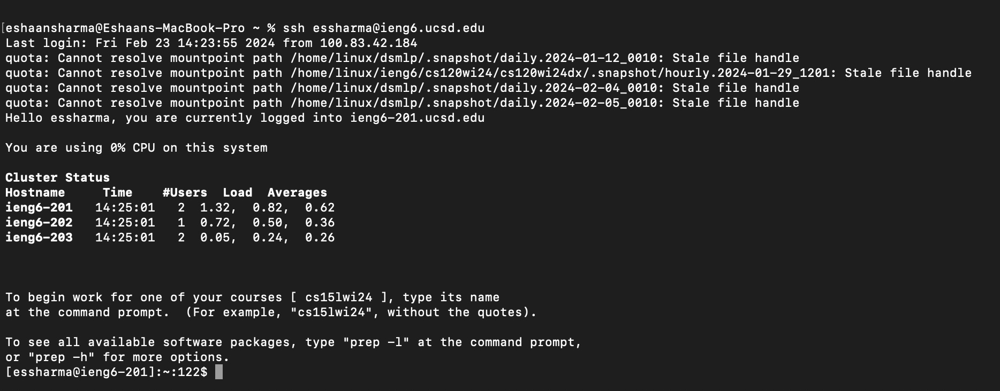
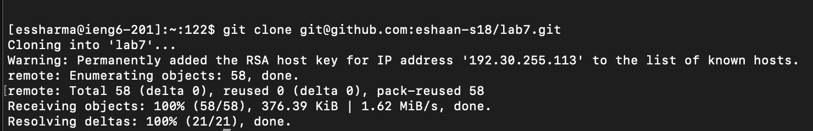

# Lab Report 4 - Vim (Week 7)


## Step 4 - Log into ieng6


**Keystrokes**:
```
s s h <space> e s s h a r m a <shift>2 i e n g 6 . u c s d . e d u <enter>
```

The `ssh` command followed by my username `essharma@ieng6.ucsd.edu` followed by `<enter>` allowed me to log into the ieng6 remote computer server


## Step 5 - Clone your fork of the repository from your Github account


**Keystrokes**:
```
g i t <space> c l o n e <space> <command>v <enter>
```

The `git` command followed by `clone` followed by `git@github.com:eshaan-s18/lab7.git` (which was pasted using `<command>v` because the SSH URL was copied on my computer) followed by `<enter>` allowed me to clone my fork of the repository from my Github account


## Step 6 - Run the tests, demonstrating that they fail


**Keystrokes**:
```
c d <space> l a b 7 <enter>
l s <enter>
b a s h <space> t e s t . s h <enter>
```

The `cd` command followed by `lab7` followed by `<enter>` allowed me to move into the `lab7` directory.
<br>
The `ls` command followed by `<enter>` allowed me to see the files in the `lab7` directory including the `test.sh`, `ListExamples.java`, and `ListExamplesTests.java` files.
<br>
The `bash` command followed by `test.sh` followed by `<enter>` allowed me to run the `test.sh` shell file to run the tests in `ListExamplesTests.java` to demonstrate tha they fail as seen by the `Tests run: 2,
Failures: 1` line
