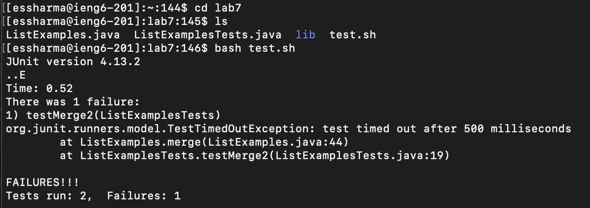

# Lab Report 4 - Vim (Week 7)


## Step 4 - Log into ieng6


**Keystrokes**:
```
s s h <space> e s s h a r m a <shift>2 i e n g 6 . u c s d . e d u <enter>
```

The `ssh` command followed by my username `essharma@ieng6.ucsd.edu` followed by `<enter>` allowed me to log into the ieng6 remote computer server


## Step 5 - Clone your fork of the repository from your Github account


**Keystrokes**:
```
g i t <space> c l o n e <space> <command>v <enter>
```

The `git` command followed by `clone` followed by `git@github.com:eshaan-s18/lab7.git` (which was pasted using `<command>v` because the SSH URL was copied on my computer) followed by `<enter>` allowed me to clone my fork of the repository from my Github account


## Step 6 - Run the tests, demonstrating that they fail


**Keystrokes**:
```
c d <space> l a b 7 <enter>
l s <enter>
b a s h <space> t e s t . s h <enter>
```

The `cd` command followed by `lab7` followed by `<enter>` allowed me to move into the `lab7` directory.
<br>
The `ls` command followed by `<enter>` allowed me to see the files in the `lab7` directory including the `test.sh`, `ListExamples.java`, and `ListExamplesTests.java` files.
<br>
The `bash` command followed by `test.sh` followed by `<enter>` allowed me to run the `test.sh` shell file to run the tests in `ListExamplesTests.java` to demonstrate that they fail as seen by the `Tests run: 2,
Failures: 1` line of the output


## Step 7 - Edit the code file to fix the failing test


**Keystrokes**:
```
v i m <space> L i <tab> . <tab> <enter>
4 3 J
1 1 L
X
I
2
<esc> : w q <enter>
```

The `vim` command followed by `Li <tab>` (which autofilled `ListExamples` in my terminal) followed by `. <tab>` (which autofilled `.java` in my terminal) followed by `<enter>` allowed me to open *vim* to edit th `ListExamples.java` file
<br>
The `43J` keystroke in vim took me down 43 lines to the line with `index1 += 1;`
<br>
The `11L` keystroke in vim took me right 11 space on the `index1 += 1;` line to the 11th character from the right `1`
<br>
The `X` keystroke in vim deleted the `1` character, leaving `index +=1;` on the line
<br>
The `I` keystroke in vim opened up *insert mode*
<br>
The `2` keystroke inserted the character `2` in the position to the left of where my cursor was (in between the `x` and `+` in the `index +=1;` line)
<br>
These keystrokes allowed me to change the `index1 += 1;` line to `index2 += 1;`
<br>
Finally, the `<esc>` command followed by `:wq` followed by `<enter`> allowed me to successfully save and exit the edited and fixed `ListExamples.java` file.


## Step 8 - Run the tests, demonstrating that they now succeed


**Keystrokes**:
```
b a s h <space> t e s t . s h <enter>
```
The `bash` command followed by `test.sh` followed by `<enter>` allowed me to run the `test.sh` shell file to run the tests in `ListExamplesTests.java` to demonstrate that they now succeed as seen by the `OK (2 tests)` line of the output

## Step 9 - Commit and push the resulting change to your Github account


